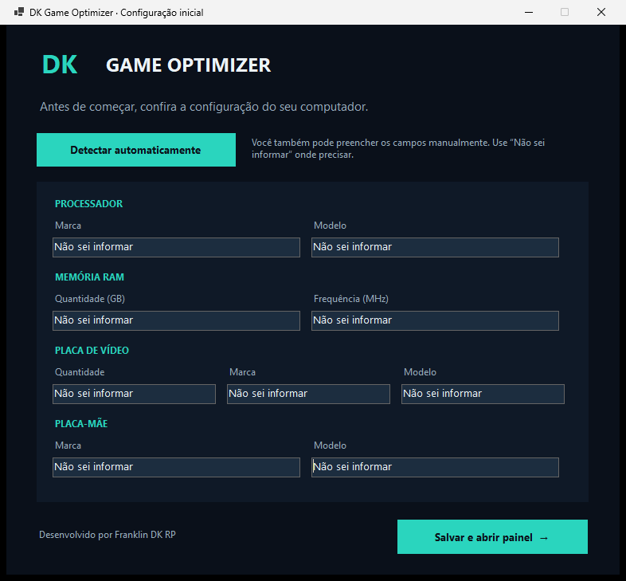
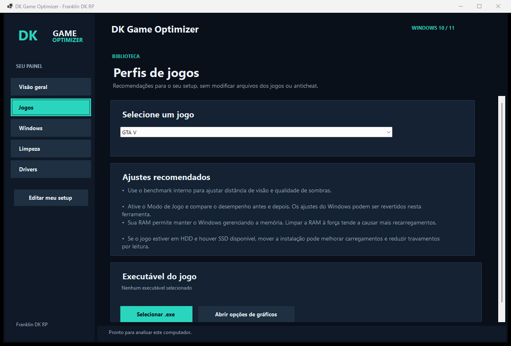

# DK Game Optimizer

Aplicativo para organizar ajustes de jogos e manutenção básica no Windows 10/11. O primeiro passo é informar o setup ou usar a detecção automática. Depois, o painel reúne recomendações por jogo, opções do Windows, limpeza com prévia e acesso aos drivers oficiais.

**Desenvolvedor:** Franklin DK RP



## O que dá para fazer

- Detectar processador, RAM e frequência, GPUs, placa-mãe, discos, sistema e versão do driver de vídeo. Cada campo pode ser preenchido manualmente ou deixado como “Não sei informar”.
- Consultar perfis de 21 jogos. As dicas mudam conforme a RAM informada e o tipo de jogo.
- Ativar o Modo de Jogo e o plano Alto desempenho quando disponível. O estado anterior é salvo para restauração no próprio aplicativo.
- Escolher o executável de um jogo e abrir as opções de gráficos do Windows para definir a GPU por aplicativo.
- Analisar temporários do usuário com mais de 7 dias e, opcionalmente, cache de shaders DirectX com mais de 30 dias. A exclusão exige confirmação e ignora arquivos recentes, bloqueados ou fora das pastas permitidas.
- Abrir Armazenamento, Otimizar Unidades, Inicialização e Windows Update. O Windows decide a operação adequada para SSD e HDD.
- Ver modelo e versão do driver de vídeo, com links para NVIDIA, AMD e Intel.



## Jogos no catálogo

GTA V, FiveM, Call of Duty: Warzone, VALORANT, CS:GO / Counter-Strike 2, Assetto Corsa, Forza Horizon 6, EA Sports FC 27, ARK: Survival Evolved, Delta Force, Red Dead Redemption 2, Tom Clancy's Ghost Recon Breakpoint, Euro Truck Simulator 2, 171, DayZ, eFootball, PUBG: Battlegrounds, Free Fire (emulador), Naruto x Boruto: Ultimate Ninja Storm Connections, Naruto Shippuden: Ultimate Ninja Storm 4 e Enlisted.

Os perfis são recomendações de configuração; o programa não altera arquivos dos jogos, não injeta código e não interfere em anticheat.

## Como usar

1. Baixe `DKGameOptimizer.exe` na página de [Releases](../../releases).
2. Abra o programa e confira os dados do setup. Clique em **Detectar automaticamente** se preferir.
3. Selecione um jogo e leia as sugestões. Em **Windows**, escolha os ajustes que deseja aplicar.
4. Em **Limpeza**, faça a análise e confirme a exclusão somente após conferir a quantidade e o espaço estimado.

O executável é portátil e não exige instalar o .NET. Os dados do setup e os estados para restauração ficam em `%LOCALAPPDATA%\DKGameOptimizer`.

## Mudanças e restauração

| Opção | O que muda | Como desfazer |
| --- | --- | --- |
| Modo de Jogo | Valor `AutoGameModeEnabled` do usuário no Registro | Botão **Restaurar anterior** |
| Alto desempenho | Plano de energia ativo, se estiver disponível | Botão **Restaurar anterior** |
| Limpeza | Remove somente os arquivos listados na análise | Exclusão não reversível; requer confirmação |

O plano Alto desempenho pode aumentar consumo e temperatura. O cache de shaders será recompilado pelos jogos quando necessário, então pode haver travamentos temporários na primeira execução. Limpar arquivos libera espaço; não há garantia de aumento de FPS. Driver e ajustes de GPU são feitos pelas telas oficiais para que você possa conferir o modelo e o efeito da mudança.

## Compilar

Requer Windows x64 e SDK do .NET 8 ou mais recente.

```powershell
dotnet run --project tests\DkGameOptimizer.Tests\DkGameOptimizer.Tests.csproj -c Release
dotnet publish src\DkGameOptimizer\DkGameOptimizer.csproj -c Release -r win-x64 --self-contained true -o artifacts\win-x64
```

O arquivo gerado fica em `artifacts\win-x64\DKGameOptimizer.exe`. O projeto usa Windows Forms e `System.Management` para ler informações locais. Não envia telemetria e não baixa drivers.

## Referências técnicas

- [Modo de Jogo no Registro do Windows](https://learn.microsoft.com/en-us/windows/apps/develop/settings/settings-windows-11)
- [Comandos `powercfg`](https://learn.microsoft.com/en-us/windows-hardware/design/device-experiences/powercfg-command-line-options)
- [Preferência de GPU para jogos no Windows](https://support.microsoft.com/en-us/windows/hardware/display-graphics/optimizations-for-windowed-games-in-windows-11)
- [Sensor de Armazenamento](https://support.microsoft.com/en-us/windows/experience/storage-filemanagement/manage-drive-space-with-storage-sense)
- [Otimização de unidades SSD e HDD](https://learn.microsoft.com/en-us/windows-server/administration/windows-commands/defrag)

## Compatibilidade

Projeto voltado para Windows 10/11 x64. Compilação e uso conferidos no Windows 11; a execução em Windows 10 ainda precisa de validação em uma instalação real. O executável não é assinado digitalmente.

Licença MIT. © 2026 Franklin DK RP.
